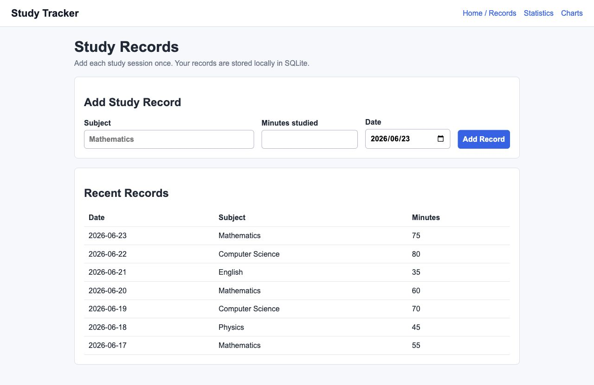
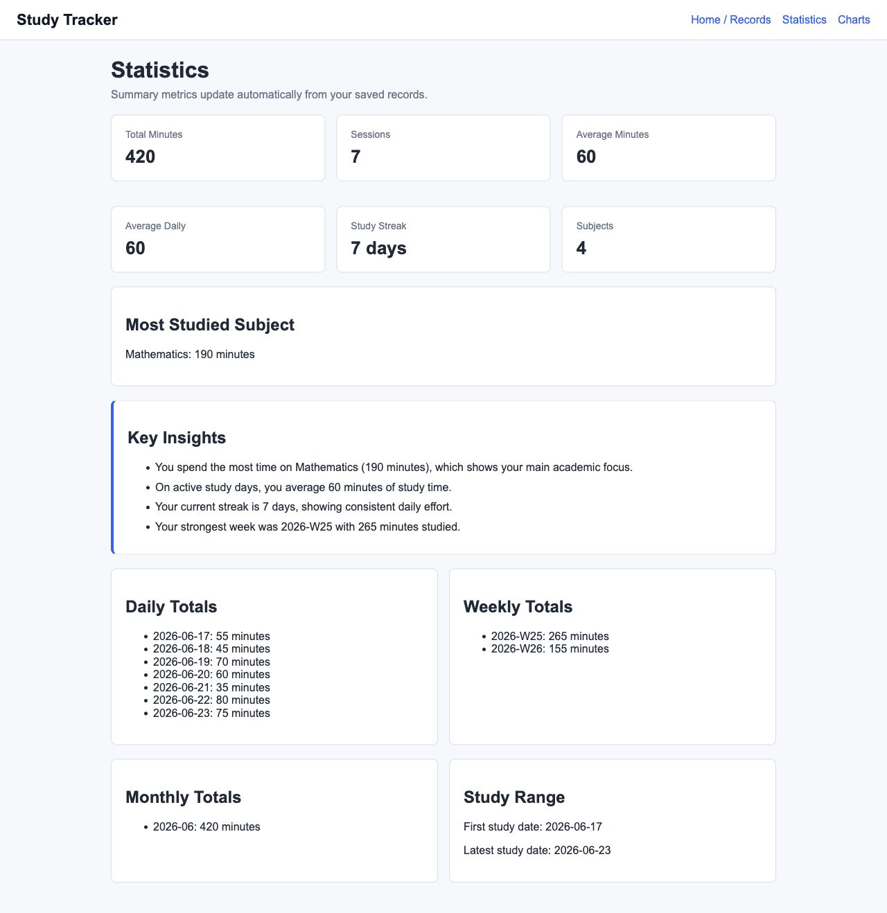
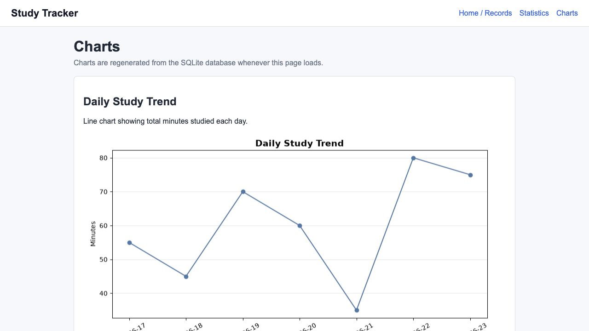

# Study Tracker

**Study Tracker** is a data-driven Flask + SQLite system that helps students
analyze and improve study behavior using computational analytics.

The project started as a simple study-time logger, but it has been upgraded into
an intelligent study analytics and decision-support dashboard. Instead of only
recording minutes, it interprets study patterns and recommends what a student
should adjust next.


## Problem Statement

Students often track homework or revision time informally, but raw logs do not
answer deeper questions:

- Am I becoming more consistent?
- Am I over-focusing on one subject?
- Which subject needs more attention?
- Which days are my most productive?
- Is my study pattern improving or declining?

Study Tracker addresses this by converting study records into structured
analytics, visualizations, and rule-based recommendations.

## Demo

| Records | Statistics | Charts |
| --- | --- | --- |
|  |  |  |

## Intelligent Analytics Layer

The application includes an `analytics_v2.py` module that calculates:

- **Productivity score** based on weekly consistency, total time, and subject balance
- **Trend detection** comparing the last 7 days with the previous 7 days
- **Weak subject analysis** based on the subject with the lowest average logged engagement
- **Best day analysis** based on total minutes by weekday
- **Study balance score** using subject distribution balance
- **Recommendations** generated from deterministic analytics rules

Example recommendations:

- "Try distributing study more evenly across subjects."
- "Your consistency is improving; keep the current rhythm."
- "Give Physics a longer focused session next."

## System Design

```text
Flask routes
    |
    |-- models.py        SQLite schema, validation, safe parameterized queries
    |-- analytics.py     backward-compatible summary statistics
    |-- analytics_v2.py  intelligent scoring, trends, balance, recommendations
    |-- charts.py        matplotlib PNG generation
    |
HTML/CSS dashboard views
```

The system keeps the design simple enough to read, but separates data storage,
analytics, visualization, and web presentation clearly.

## Features

- Add study records with date, subject, and minutes studied
- Store data locally in SQLite
- View recent records in a responsive table
- See daily, weekly, and monthly study totals
- Calculate current study streak and average daily study time
- Use an intelligent dashboard for decision support
- Generate matplotlib charts for daily trends, weekly totals, and subject distribution

## Tech Stack

- Python
- Flask
- SQLite
- matplotlib
- HTML/CSS
- pytest

## Setup

```bash
python -m venv .venv
source .venv/bin/activate
pip install -r requirements.txt
```

`sqlite3` is included with Python, so it does not need a separate pip install.

## Run

Initialize the database:

```bash
python -m study_tracker.init_db
```

Start the web app:

```bash
python app.py
```

Then open:

```text
http://127.0.0.1:5000
```

## Main Pages

- `/` - intelligent study dashboard
- `/dashboard` - same decision-support dashboard
- `/records` - add and view study records
- `/statistics` - detailed statistical summaries
- `/charts` - generated matplotlib charts

## Project Structure

```text
study-tracker/
├── app.py
├── requirements.txt
├── data/
│   └── .gitkeep
├── docs/
│   └── screenshots/
├── src/
│   └── study_tracker/
│       ├── app.py
│       ├── models.py
│       ├── analytics.py
│       ├── analytics_v2.py
│       ├── charts.py
│       ├── init_db.py
│       ├── static/
│       └── templates/
└── tests/
```

## Why This Is Portfolio-Level

This project demonstrates a full applied CS workflow:

1. Define a real student productivity problem.
2. Design a database-backed web system.
3. Collect structured data.
4. Apply computational analytics.
5. Generate interpretable recommendations.
6. Present insights through a clean dashboard.

It is intentionally scoped: the goal is not to add many features, but to show
clear data modeling, algorithmic thinking, and useful decision support.
