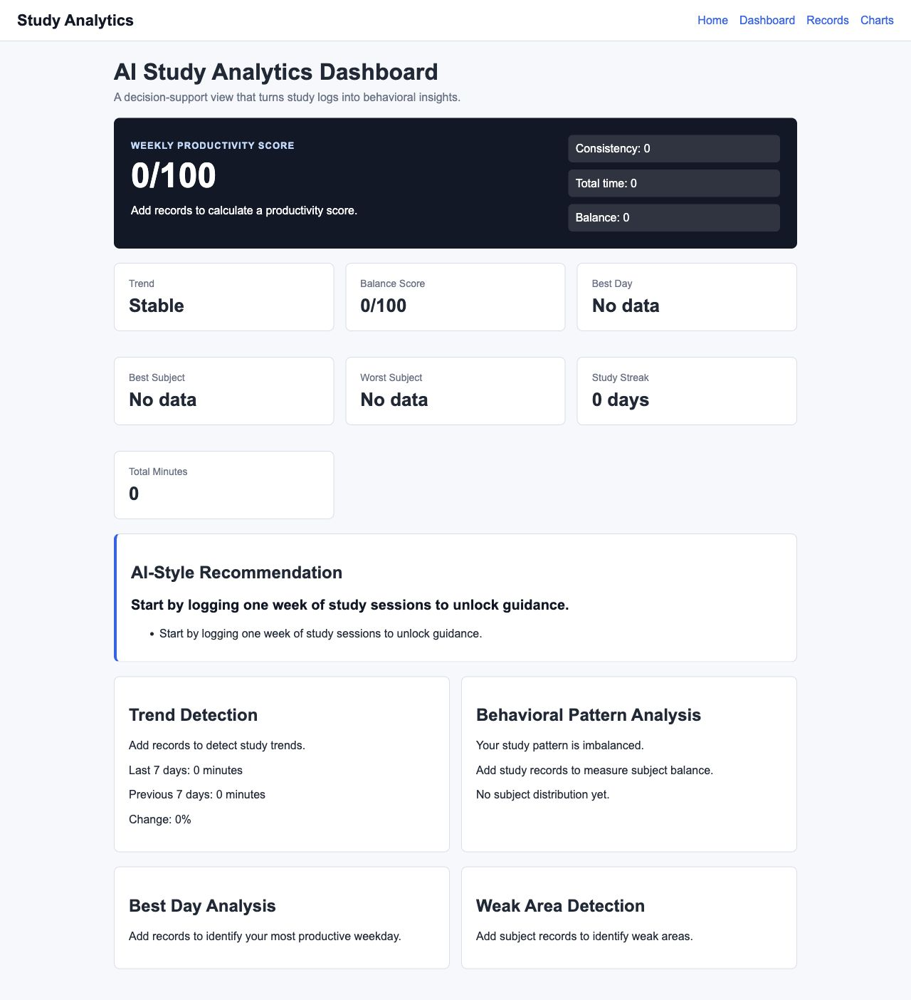

# Study Tracker: Data-Driven Study Behavior Analytics System

Study Tracker is a Flask-based analytics application that helps students
understand and improve learning efficiency. Rather than functioning only as a
time tracker, the system collects study records, analyzes behavioral patterns,
and presents actionable insights through a web dashboard.



## Problem Statement

Many students record how long they study, but time tracking alone does not
explain whether their learning habits are effective. A student may spend many
hours studying while still showing inconsistent routines, uneven subject
coverage, or declining weekly progress.

The core problem is that raw study logs do not automatically reveal study
efficiency. Students need a system that can interpret their data, detect
patterns, and translate those patterns into clear feedback about consistency,
focus, and balance.

## Solution

Study Tracker addresses this problem as a data-driven study behavior analytics
system. The application collects structured study records, stores them in a
local SQLite database, processes them through analytics modules, and displays
results through a clean Flask dashboard.

The system follows a simple pipeline: data collection through a web form,
persistent storage in SQLite, analytics processing in Python, insight generation
through a rule-based insight engine, and dashboard visualization using HTML/CSS
and Matplotlib-generated charts. This turns individual study sessions into a
decision-support tool for improving learning habits.

## Key Features

Study Tracker includes a Flask web app for adding and reviewing study records,
a SQLite database layer for reliable local persistence, and a study analytics
system for daily, weekly, and monthly summaries. The project also includes an
insight engine that produces productivity scoring, trend detection, weak area
analysis, and behavioral feedback.

The dashboard presents metrics in a structured interface, while the charts page
uses Matplotlib to visualize daily study trends, weekly totals, and subject
distribution. Together, these features make the project more than a logging
tool: it becomes a student-facing analytics system.

## System Architecture

The project is organized into focused modules so that data handling, analytics,
visualization, and web presentation remain separate.

```text
study-tracker/
├── app.py                         Project entry point
├── src/study_tracker/
│   ├── app.py                     Flask routes and web application setup
│   ├── models.py                  SQLite database schema and query layer
│   ├── analytics.py               Core statistical summaries
│   ├── study_insights.py          Advanced insight engine
│   ├── charts.py                  Matplotlib chart generation
│   ├── templates/                 HTML pages
│   └── static/                    CSS and generated chart images
└── tests/                         Automated test suite
```

`app.py` connects the web interface to the backend modules. `models.py` defines
the database layer, including validation and parameterized SQLite queries.
`analytics.py` calculates basic statistics such as totals, averages, and
streaks. `study_insights.py` contains the higher-level behavior analysis used
by the dashboard. `charts.py` generates PNG visualizations for study trends and
subject distribution.

## Insights

The insight engine is designed to make study data interpretable. It calculates
a productivity score from weekly study time, consistency, and subject balance,
then normalizes the result to a 0-100 scale.

Trend detection compares the latest seven days with the previous seven days and
classifies the student's behavior as improving, stable, or declining. Weak
subject analysis identifies the subject with the lowest logged engagement,
helping the student notice areas that may require more deliberate attention.

Behavioral analysis detects imbalance in subject distribution and highlights
over-focus when one subject receives a disproportionate amount of study time.
These outputs are combined into recommendation messages that help students
decide how to adjust their next study week.

## Tech Stack

The application is built with Python, Flask, SQLite, and Matplotlib. Flask
provides the web interface, SQLite provides local structured storage, and
Matplotlib generates visual summaries. The project also uses HTML/CSS for the
frontend and pytest for automated testing.

## Running the Project

```bash
python -m venv .venv
source .venv/bin/activate
pip install -r requirements.txt
python app.py
```

Then open:

```text
http://127.0.0.1:5000
```

SQLite is included with Python, so no separate SQLite package is required.

## Learning Outcomes

This project demonstrates backend development through Flask routing, form
handling, validation, and SQLite persistence. It demonstrates data analysis
through summary statistics, productivity scoring, trend classification, and
behavioral pattern detection.

It also reflects system design and product thinking: the application separates
concerns across modules, turns raw data into user-facing insights, and focuses
on a real student problem rather than adding unnecessary features. The result is
a compact but complete portfolio project showing how software can support
learning decisions through structured data and interpretable analytics.
